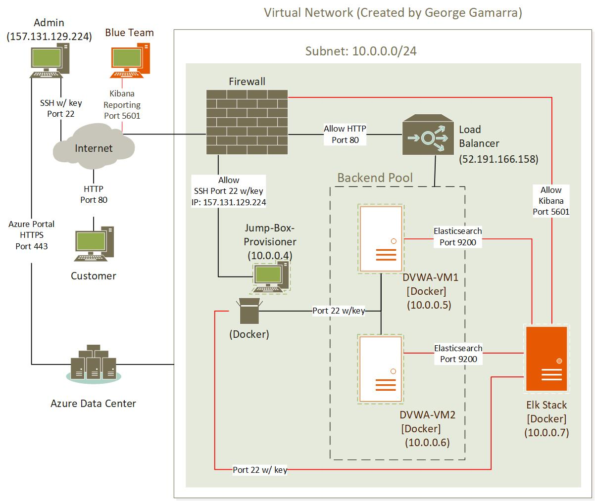
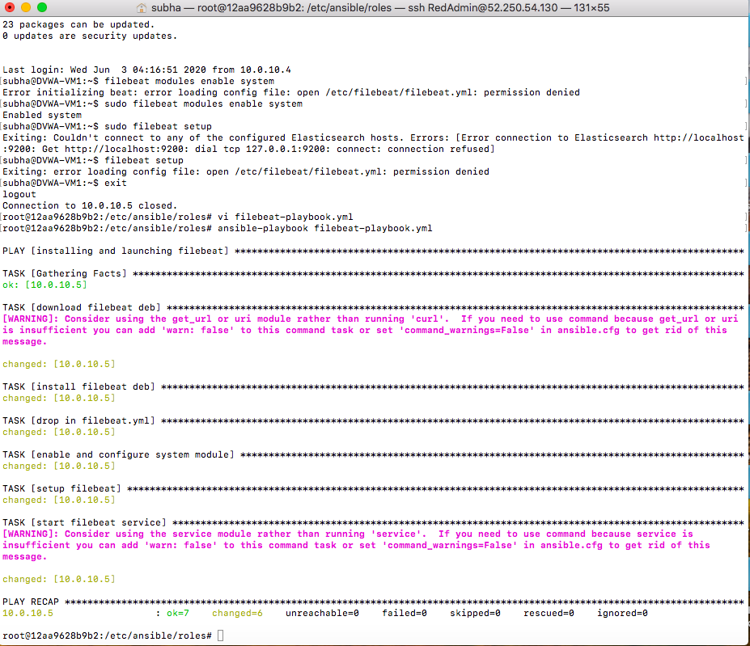

# Automated ELK Stack Deployment
In this project, I implement an ELK stack to monitor a website in a Microsoft Azure cloud environment. 

Skills and knowledge demonstrated:
- Using ANSIBLE provisioning software and DOCKER container environments to create an ELK stack server.
- Deploying ELASTIC lightweight shippers on web servers to collect data and send to the ELK stack.
##
## Deliverables
- ANSIBLE files that generate and configure the highlighted orange areas in the following diagram.

### Playbooks, Configuration Files
The Ansible files, known as **PLAYBOOKS**, contain YAML code and have beeen tested and used to generate a live ELK deployment.  The PLAYBOOKS are executed from the Ansible Docker provisioner container within the Jump-Box-Provisioner VM.  The PLAYBOOKS can be used to recreate the entire deployment . Alternatively, select portions of a PLAYBOOK may be used to install only certain pieces of specific functions desired.  For example, install FILEBEAT, but not METRICBEAT.  NOTE: Configuration files also need to be placed prior to generaton for proper deployment. (See comments within each config file for target directory placement.)

- 
- 

This document contains additional project information outlined below.
- Description of the Topology
- Access Policies
- ELK Configuration
  - Beats in Use
  - Machines Being Monitored
- How to Use the Ansible Build
##
### Description of the Topology

The main purpose of this network is to expose a load-balanced and monitored instance of DVWA (a.k.a: the D*mn Vulnerable Web Application.)

<ins>Load balancing </ins>  ensures that the application will be highly **available**, in addition to restricting **traffic** to the network.

- **Load Balancers protect the availability aspected of networked environments. On a normal basis, the load balancer can handle initial communication with incoming client request thus releasing the application from these tasks thus allowing applications to respond quicker.  In an extreme security situation, load balancers can help to diminish effects of DDoS (Distributed Denial Of Service) attack by redirecting malicious traffic to alternative sources so as not to overwhelm and deny access to the main application servers.** 

<ins>Jump Box</ins> advantages included efficiency and consistancy in a cloud environment

- **If more virtual machine resources are needed, the additional VM capacity can be rolled out as 'containers' which are optimized smaller instances of VMs focusing on the kernal rather than graphical user interface or other administrative features.  The Jump box can be used to manage all additional containers.  The implementation method ensures that all containers are implemented with pre-defined images that are the same in every case via the jump box.**

<ins>ELK server integration</ins> allows users to easily monitor the vulnerable VMs for changes to:
- **The file system, which traditionally in the past has been captured by log files**
- **Machine metrics, or VM usage in particular CPU usage and uptime (or how low a has a machine has been on)**

<ins>Virtual Machines</ins>

(The public IP addresses will vary by deployment effort.)

|         Name         | Function  | Load Balancer | Private IP |    Public IP   |  Operating System  |
|----------------------|-----------|---------------|------------|----------------|--------------------|
| Jump-Box-Provisioner | Gateway   |      No       |  10.0.0.4  | 52.247.211.204 | Linux-Ubuntu 18.04 |
| DVWA-VM1             | Webserver |      Yes      |  10.0.0.5  | 52.191.166.158 | Linux-Ubuntu 18.04 |
| DVWA-VM2             | Webserver |      Yes      |  10.0.0.6  | 52.191.166.158 | Linux-Ubuntu 18.04 |
| ELK-Stack            | ELKserver |      No       |  10.0.0.7  | 52.183.78.79   | Linux-Ubuntu 18.04 |
##
### Access Policies

<ins>Firewall</ins> functionality is performed by and set within the Azure Network Security Group.

<ins>DVWA web servers</ins>, defined as within the backend pool of the load balancers, are NOT exposed directly to the public Internet and are restricted to http traffic only when they receive an external request. 

<ins>Jump-Box-Provisioner</ins> is the only VM that can accept SSH connections from the Internet. Access to this VM is only allowed from the following IP addresses and restricted to specific SSH Port traffic:
- **157.131.129.224, Port 22**: Referring to the Administrator's console connection via SSH.  
- The SSH traffic is secured with a shared RSA Key between the external administrator and Jump Box.

Machines within the network can only be accessed and configured by **Jump-Box-Provisioner** VM.
- **Jump-Box-Provisioner** Private IP Address is 10.0.0.4

<ins>ELK Stack</ins> server can only except external request for Kibana data via port 5601.

<ins>Summary of Access Policies</ins>

| VM Name              |     Administrative Accesss      |   Cloud Requests Allowed       |
|----------------------|---------------------------------|--------------------------------|
| Jump-Box-Provisioner | 157.131.129.224 (Port22 w/key)  |             No                 |
| Elk-Stack            | 10.0.0.4 (Jump-Box-Provisioner) | 107.3.134.166 (Port 5601 Only) |
| DVWA1, DVWA2         | 10.0.0.4 (Jump-Box-Provisioner) | Load Balancer (Port 80 Only)   |
##
### Elk Configuration

Ansible was used to automate configuration of the ELK machine. No configuration was performed manually, which is advantageous because:
- **The Administrator can rerun the configuration as many times and more easily as needed than if we had to configure physical machines or fully deployed VM's.  Thus we can also more easily ensure multiple instances have the same configuration at setup.**

The playbook implements the following tasks:
- **Increases Virtual Memory**
- **Installs Docker**
- **Installs Pip**
- **Pip Module Usage**
- **Downloads and launches the ELK Container**

The following screenshot displays the result of running `docker ps` after successfully configuring the ELK instance.

- 

### Target Machines & Beats
This ELK server is configured to monitor the following machines:
- **DVWA-VM1 (10.0.0.5)**
- **DVWA-VM2 (10.0.0.6)**

We have installed the following ELASTIC "Beats" data shippers on these machines:
- **filebeats**
- **Metricbeats**

These Beats allow us to collect the following information from the web servers.(DVWM-1, DVWA-2):
- **Filebeat collects file system logs**
- **Mertricbeat collects metrics from the operating system and from services running on the servers** 

### Using the Playbook
In order to use the playbook, you will need to have an Ansible control node already configured. Assuming you have such a control node provisioned: 

SSH into the control node and follow the steps below:
- Copy the **/files/filebeat-configuration.yml** file to **filebeat.yml file**.
- Update the **/etc/ansible/hosts** file to include ports
- Run the playbook, and navigate to **http://[ElkserverIP]:5601** to check that the installation worked as expected.

_Answer the following questions to fill in the blanks:_
- Which file is the playbook? **filebeat-playbook.yml** Where do you copy it? **/roles/filebeat.yml**
- Which file do you update to make Ansible run the playbook on a specific machine? **/etc/ansible/hosts**
- How do I specify which machine to install the ELK server on versus which to install Filebeat on? **hosts: elkserver**
- Which URL do you navigate to in order to check that the ELK server is running? **http://[ElkserverIP]:5601**
