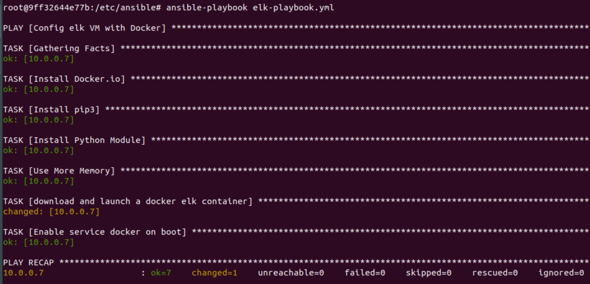
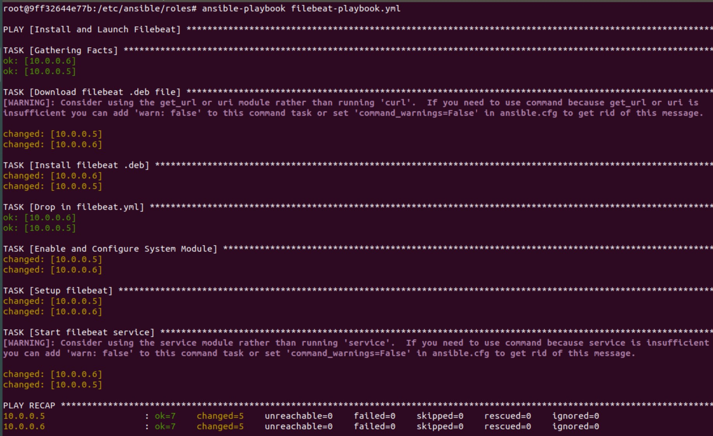
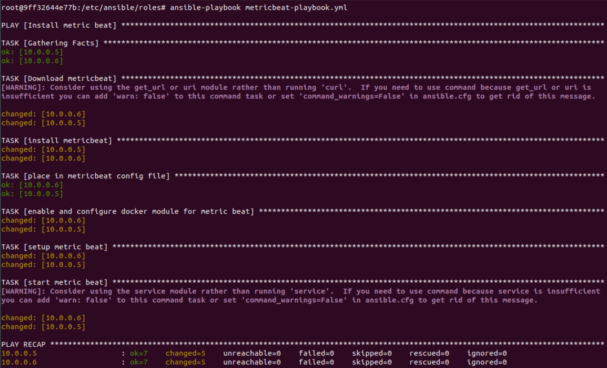
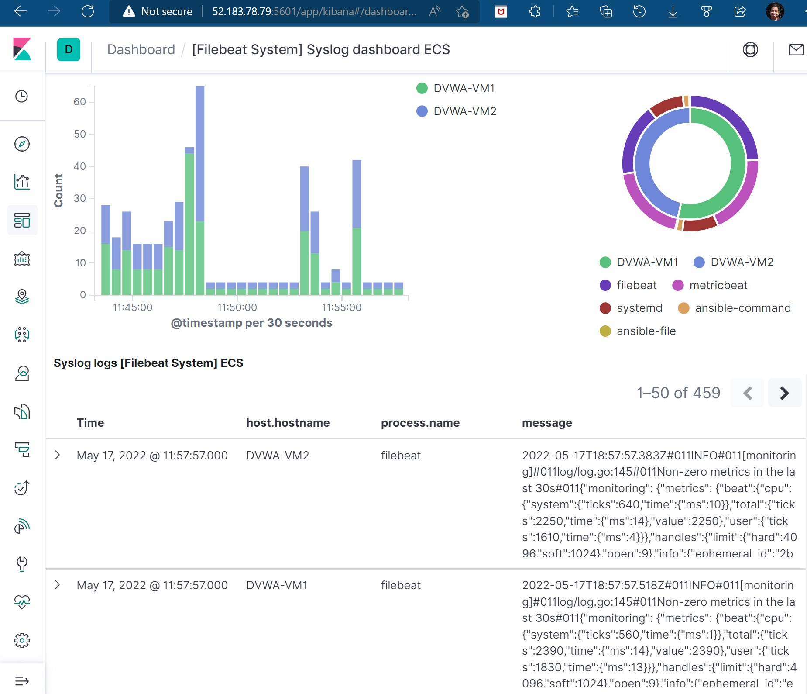
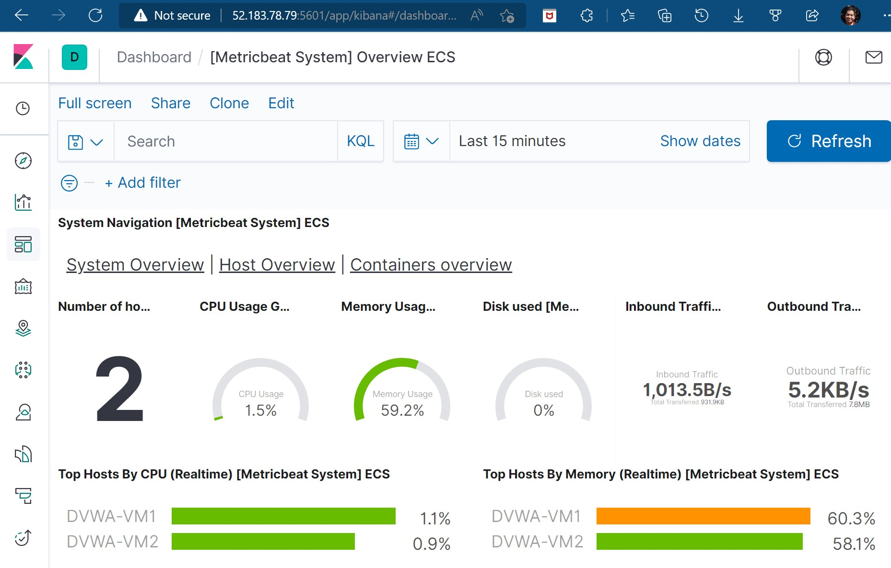
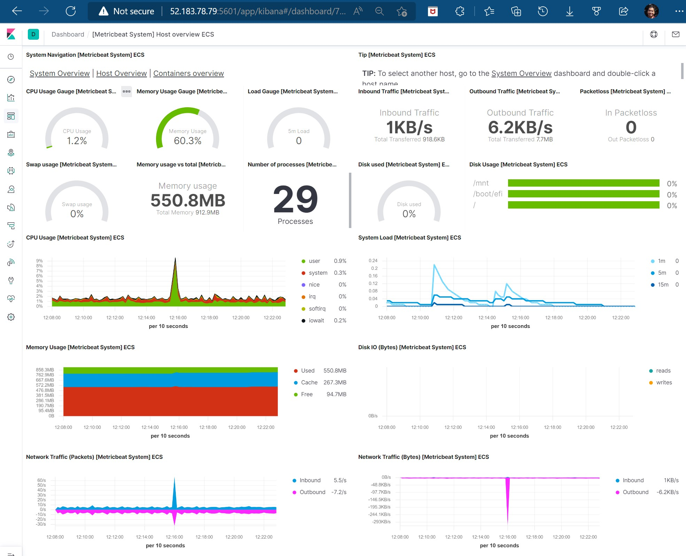
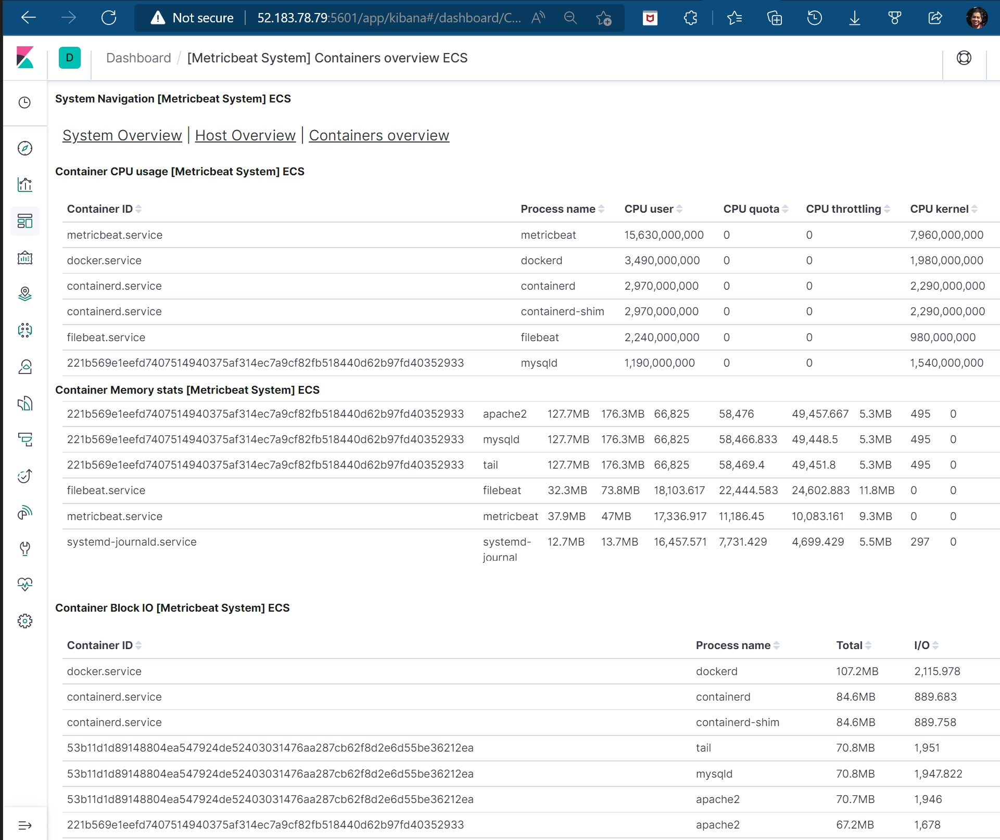

# Automated ELK Stack Deployment

## Introduction

In this project, I create and deploy a live security solution known as an ELK monitoring stack within a previously created virtual network.  This solution will allow an analyst to monitor all network traffic.

ELK stands for ELASTICSEARCH (search and analytics engine), LOGSTASH (Server side log collection tool), KIBANA (Data visualization tool)

An ELK Stack allows an analyst to:
- Collect logs from multiple machine sources to load and contain in a single database.
- Execute complicated searches
- Build graphs, charts and other visual tools from network data

Skills and knowledge demonstrated:
- Using ANSIBLE provisioning software and DOCKER container environments to create an ELK stack server.
- Deploying ELASTIC lightweight shippers on web servers to collect data and send to the ELK stack.

## Outline of Presentation
- Deliverables and Network Diagram
- Description of Topology
- Access Policies
- ELK Configuration
  - Machines Being Monitored
  - Beats in Use
- SCREENSHOTS - Success Build and Dashboard Confirmation
- How to Use the Ansible Playbook Builds
 
## Deliverables
- ANSIBLE files that generate and configure the highlighted orange areas in the following diagram.

### Playbooks, Configuration Files
The Ansible files, known as **PLAYBOOKS**, contain YAML code and have been tested and used to generate a live ELK deployment.  The PLAYBOOKS are executed from the <ins>Ansible Docker</ins> provisioner container within the <ins>Jump-Box-Provisioner VM</ins>.  Use the PLAYBOOKS to recreate the entire deployment. Alternately, use select portions of a PLAYBOOK to install only certain functions desired.  For example, install the FILEBEAT data shipper, but not METRICBEAT.  (See comments within each configuration file for target directory placement.)

- 
- 

##
### Description of the Topology

The main purpose of this network is to prepare a load balanced and monitored instance of DVWA (D*mn Vulnerable Web Application)

<ins>Load balancing </ins>  ensures that the application will be **highly available**, in addition to **restricting traffic** to the network.

- **Load Balancers protect the availability of networked environments. On a normal basis, the load balancer can handle initial communication with incoming client requests thus releasing the application from these tasks and allowing the applications to respond quicker.  In an extreme security situation, load balancers can help to diminish the effects of DDoS (Distributed Denial Of Service) attacks by redirecting malicious traffic to alternative sources so as not to overwhelm and deny access to the main application servers.** 

<ins>Jump Box</ins> advantages include efficiency and consistency in a cloud environment

- **If more virtual machine resources are needed, the additional VM capacity can be rolled out as 'containers' which are optimized smaller instances of VMs focusing on the kernel rather than graphical user interface or other administrative features.  Use the Jump box to manage all additional containers.  The implementation method ensures that all containers are implemented with pre-defined images that are the same in every case.**

<ins>ELK Stack</ins> integration allows defenders to monitor vulnerable web servers for changes in:
- **The file system, which is captured in log files**
- **Machine metrics, such as VM usage, in particular CPU usage and uptime**

<ins>Summary of Virtual Machines</ins>

(The public IP addresses will vary by deployment effort.)

|         Name         | Function  | Load Balancer | Private IP |    Public IP   |  Operating System  |
|----------------------|-----------|---------------|------------|----------------|--------------------|
| Jump-Box-Provisioner | Gateway   |      No       |  10.0.0.4  | 52.247.211.204 | Linux-Ubuntu 18.04 |
| DVWA-VM1             | Webserver |      Yes      |  10.0.0.5  | 52.191.166.158 | Linux-Ubuntu 18.04 |
| DVWA-VM2             | Webserver |      Yes      |  10.0.0.6  | 52.191.166.158 | Linux-Ubuntu 18.04 |
| ELK-Stack            | ELKserver |      No       |  10.0.0.7  | 52.183.78.79   | Linux-Ubuntu 18.04 |
##
### Access Policies

<ins>Firewall</ins> functionality is performed by and set within the Azure Network Security Group.

<ins>DVWA web servers</ins> are NOT exposed directly to the public Internet, but are restricted to http requests only when screened by the firewall and received via the load balancer.
- **Security Considerations**: web server hardening was outside the scope of this exercise.  Additional steps to further secure communications could be the use of https (port 443) encrypted packets, site certificates, and VPNs with externally based users.  

<ins>Jump-Box-Provisioner</ins> is the only VM that can accept SSH connections from the Internet. Access to this VM is only allowed from the following IP addresses and restricted to specific SSH Port traffic:
- **157.131.129.224, Port 22**: Referring to the Administrator's console connection via SSH.  
- The SSH traffic is secured with a shared RSA Key between the external administrator and Jump Box.

Machines within the network can only be accessed and configured by **Jump-Box-Provisioner** VM.
- **Jump-Box-Provisioner** Private IP Address is 10.0.0.4

<ins>ELK Stack</ins> server can only accept external request for Kibana dashboard data through port 5601.

<ins>Summary of Access Policies</ins>

| VM Name              |     Administrative Access      |   Cloud Requests Allowed       |
|----------------------|---------------------------------|--------------------------------|
| Jump-Box-Provisioner | 157.131.129.224 (Port22 w/key)  |             No                 |
| Elk-Stack            | 10.0.0.4 (Jump-Box-Provisioner) | 107.3.134.166 (Port 5601 Only) |
| DVWA1, DVWA2         | 10.0.0.4 (Jump-Box-Provisioner) | Load Balancer (Port 80 Only)   |
##
## ELK Configuration

ANSIBLE provisioning software was used to automate configuration of the ELK machine. No configuration was performed manually, which is advantageous because:
- **The Administrator can rerun the configuration more easily as needed than if we had to configure physical machines or fully deployed VM's.  Thus we can also more easily ensure multiple instances have the same configuration at setup.**

The ELK playbook implements the following tasks:
- **Increases Virtual Memory**
- **Installs Docker**
- **Installs Pip**
- **Pip Module Usage**
- **Downloads and launches the ELK Container**

##
### Machines Being Monitored
The ELK Stack server is configured to monitor the following web servers:
- **DVWA-VM1 (10.0.0.5)**
- **DVWA-VM2 (10.0.0.6)**
##
### BEATS in Use
I have installed the following ELASTIC "Beats" lightweight shippers on the monitored machines to facilitate collection and transmission of data to the ELK Stack:
- **Filebeat**
- **Metricbeat**

These Beats allow collecting the following information from the web servers.:
- **Filebeat collects file system logs**
- **Metricbeat collects performance data from the operating system and from services running on the servers** 
##
## SCREENSHOTS - Successful Build and Working Dashboard
The following images display the actual results after running `DOCKER-ANSIBLE` PLAYBOOKS.  
- The ELK stack server was deployed.
- Beats data shippers were installed on the webservers.
- Dashboards can be generated from captured data activity.
##
- PLAYBOOK: Create/Configure/Start ELK Stack

##
- PLAYBOOK: Configure Web Servers with FILEBEAT

##
- PLAYBOOK:  Configure Web Servers with METRICBEAT

##
- DASHBOARDS Working and Receiving Data

##
### How to Use the Ansible Playbook Builds
In order to use the PLAYBOOKS, you will need to have Ansible already configured (e.g.Ansible Docker Container on the Jump Box). Assuming you have such a control node provisioned: 

SSH into the control node and follow the steps below:
- Refer to the Git repository at top of page for file copies
- Copy **ansible.cfg** to /etc/ansible
- Copy **filebeat-config.yml** and **metricbeat-config.yml** to /etc/ansible/files
- Copy **install-DVWA.yml** and **install-elk.yml** to /etc/ansible.  See comment in install-elk.yml for troubleshooting issues.
- Copy **filebeat-playbook.yml** and **metricbeat-playbook.yml** to /etc/ansible/roles
- Update the **/etc/ansible/hosts** file sections [webservers] and [elkserver] with target private IP address.
- Run the playbooks using the  `ansible-playbook [filename]` command.
- Navigate to **http://[ElkserverIP]:5601** to check that the installation worked as expected.
