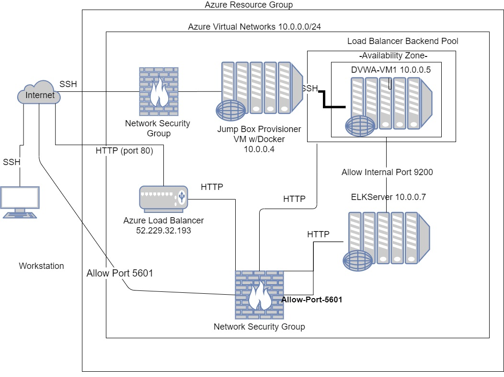

# Cybersecurity Project: ELK Monitoring Stack Deployment
This is a project to setup an ELK stack to monitor a website using Microsoft Azure cloud environment.

## Automated ELK Stack Deployment

The files in this repository were used to configure the network depicted below.

These files have been tested and used to generate a live ELK deployment on Azure. They can be used to either recreate the entire deployment pictured above. Alternatively, select portions of the **PLAYBOOK** file may be used to install only certain pieces of it, such as Filebeat.

- 

This document contains the following details:
- Description of the Topology
- Access Policies
- ELK Configuration
  - Beats in Use
  - Machines Being Monitored
- How to Use the Ansible Build

### Description of the Topology

The main purpose of this network is to expose a load-balanced and monitored instance of DVWA (a.k.a: the D*mn Vulnerable Web Application.)

Load balancing ensures that the application will be highly **available**, in addition to restricting **traffic** to the network.

- **Load Balancers protect the availability aspected of networked environments. On a normal basis, the load balancer can handle initial communication with incoming client request thus releasing the application from these tasks thus allowing applications to respond quicker.  In an extreme security situation, load balancers can help to diminish effects of DDoS (Distributed Denial Of Service) attack by redirecting malicious traffic to alternative sources so as not to overwhelm and deny access to the main application servers.** 

- **A Jump Box has significant effiency and consistancy advantages in a cloud environment.  If more virtual machine resources are needed, the additional VM capacity can be rolled out as 'containers' which are optimized smaller instances of VMs focusing on the kernal rather than graphical user interface or other administrative features.  The Jump box can be used to manage all additional containers.  The implementation method ensures that all containers are implemented with pre-defined images that are the same in every case via the jump box.**

Integrating an ELK server allows users to easily monitor the vulnerable VMs for changes to:
- **The file system, which traditionally in the past has been captured by log files**
- **Machine metrics, or VM usage in particular CPU usage and uptime (or how low a has a machine has been on**

The configuration details of each machine may be found below.

| Name     | Function | IP Address | Operating System |
|----------|----------|------------|------------------|
| Jump Box | Gateway  | 10.0.0.4   | Linux            |
| DVWA-VM1 | Webserver| 10.0.0.5   | Linux            |
| ESVM1    | Webserver| 10.0.0.7   | Linux            |

ESVM1 = Elk Stack Virtual Machine created through Ansible Container Management of Jump Box.
(The Private IP Addresses may vary relative to a deployment effort.)

### Access Policies

The machines on the internal network are not exposed to the public Internet. 

Only the **Jump Box** and **ELKServer** machine can accept connections from the Internet. Access to this machine is only allowed from the following IP addresses:
- **107.3.134.166** (Relative to each implementation adminstrator for JumpBox and ElkServer.  Add and restrict as needed.)

Machines within the network can only be accessed by **Jump Box**.
- **The Jump Box IP Address is 10.0.0.4**

A summary of the access policies in place can be found in the table below.

| Name     | Publicly Accessible | Allowed IP Addresses |
|----------|---------------------|----------------------|
| Jump Box | Yes                 | 107.3.134.166        |
|          |                     |                      |
| ElkServer| Yes                 | 107.3.134.166        |
|          |                     |  10.0.0.4            |

(Restriction set in Azure Network Security Group)

### Elk Configuration

Ansible was used to automate configuration of the ELK machine. No configuration was performed manually, which is advantageous because...
- **The main advantage of automating configuration with Ansible is we can rerun the configuration as many times and more easily as needed than if we had to configure physical machines or fully deployed VM's.  Thus we can also more easily ensure multiple instances have the same configuration.**

The playbook implements the following tasks:
- **Increases Virtual Memory**
- **Installs Docker**
- **Installs Pip**
- **Pip Module Usage**
- **Downloads and launches the ELK Container**

The following screenshot displays the result of running `docker ps` after successfully configuring the ELK instance.

- 

### Target Machines & Beats
This ELK server is configured to monitor the following machines:
- _TODO: List the IP addresses of the machines you are monitoring_

We have installed the following Beats on these machines:
- **DVWA-VM1 (10.0.0.5)

These Beats allow us to collect the following information from each machine:
- _TODO: In 1-2 sentences, explain what kind of data each beat collects, and provide 1 example of what you expect to see. E.g., `Winlogbeat` collects Windows logs, which we use to track user logon events, etc._

### Using the Playbook
In order to use the playbook, you will need to have an Ansible control node already configured. Assuming you have such a control node provisioned: 

SSH into the control node and follow the steps below:
- Copy the _____ file to _____.
- Update the _____ file to include...
- Run the playbook, and navigate to ____ to check that the installation worked as expected.

_TODO: Answer the following questions to fill in the blanks:_
- _Which file is the playbook? Where do you copy it?_
- _Which file do you update to make Ansible run the playbook on a specific machine? How do I specify which machine to install the ELK server on versus which to install Filebeat on?_
- _Which URL do you navigate to in order to check that the ELK server is running?

_As a **Bonus**, provide the specific commands the user will need to run to download the playbook, update the files, etc._
